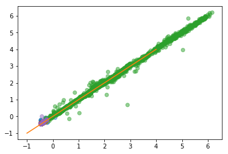
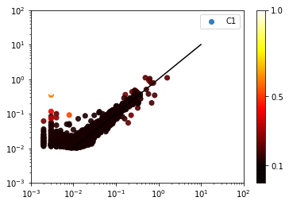
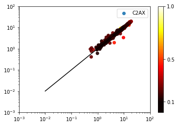
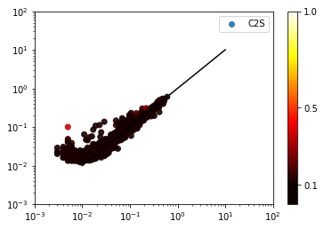
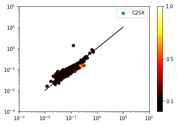
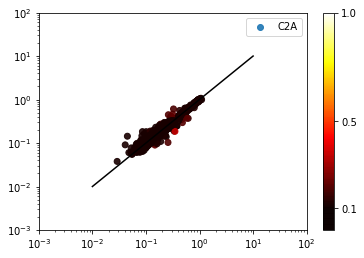
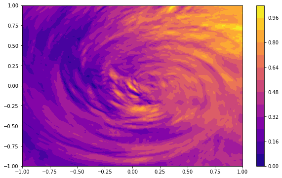
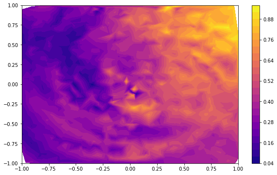
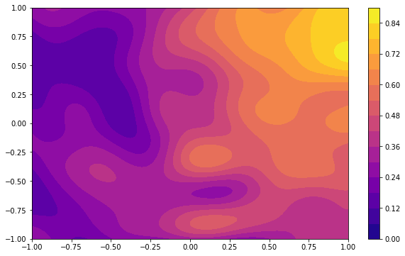
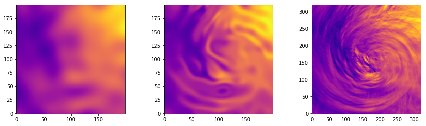

# DGP Model for Biophysical Data

This repository contains an implementation of a Doubly-Stochastic Deep Gaussian Process (DGP) for analyzing biophysical data, with a focus on predicting the concentration of Colored Dissolved Organic Matter (CDOM). The DGP model is built using the `gpflow` framework and is optimized for performance over different cases of water bodies (C1, C2A, C2S, C2AX, and C2SX).

## Table of Contents

- [Overview](#overview)
- [Data](#data)
- [Installation](#installation)
- [Usage](#usage)
- [Results](#results)
- [References](#references)

## Overview

This implementation focuses on predicting biophysical properties using Gaussian Processes. Specifically, it compares the performance of a DGP model to a Neural Network model (ONNS). 

The model is trained on spectral reflectance data (Rrs) from various bands, using a dataset of simulated and real-world measurements from different water bodies. The primary target variable is CDOM (Colored Dissolved Organic Matter), which is predicted using a combination of DGP and traditional machine learning techniques.


## Data

Two datasets are used in this project:
1. `C2X_ONNSv04_HL_20151110_Rrs_fn_OLCI.txt`: Contains the biophysical data.
2. `HL_20151110_Rrs_fn_realOLCIbands.txt`: Contains the corresponding spectral data in OLCI bands.

These datasets must be preprocessed and cleaned for missing values before being used for training the model.

## Installation

To use this code, you need to install the following dependencies:

- Python 3.x
- numpy
- pandas
- matplotlib
- seaborn
- gpflow
- scipy

Install the required Python packages by running:

```bash
pip install numpy pandas matplotlib seaborn gpflow scipy
```

## Usage


### Load libraries

```python
import os
import sys
import copy
import time
import numpy as np
import pandas as pd
import seaborn as sns
import matplotlib.pyplot as plt
sys.path.append('../../installables/Doubly-Stochastic-DGP/')
sys.path.append('/home/daniel/data/DGP_DATA/C2X/')
from doubly_stochastic_dgp.dgp import DGP
from scipy.cluster.vq import kmeans2
from scipy.io import loadmat
from gpflow.likelihoods import Gaussian
from gpflow.kernels import RBF, White, Constant
from gpflow.mean_functions import Constant
from gpflow.models.sgpr import SGPR, GPRFITC
from gpflow.models.svgp import SVGP
from gpflow.models.gpr import GPR
from gpflow.training import AdamOptimizer, ScipyOptimizer, NatGradOptimizer
from gpflow.actions import Action, Loop
from gpflow import autoflow, params_as_tensors
```

### Define functions

```python
def scale_auto(X,Y):
    """
    Subtract mean and scale with std
    """
    mu_X = X.mean(axis=0); std_X = X.std(axis=0)
    mu_Y = Y.mean(axis=0); std_Y = Y.std(axis=0)
    Xscaled = (X-mu_X)/std_X
    Yscaled = (Y-mu_Y)/std_Y
    return (Xscaled, Yscaled, mu_X, mu_Y, std_X, std_Y)

def scale_manu(X,Y,mu_X, mu_Y, std_X, std_Y):
    """
    Subtract mean and scale with std
    """
    Xscaled = (X-mu_X)/std_X
    Yscaled = (Y-mu_Y)/std_Y
    return (Xscaled, Yscaled)


def make_DGP(X,Y,Z,L,nsam=1,mb=10000):
    kernels = []
    d = X.shape[1]
    
    k = RBF(d) #+ White(1., variance=1e-5)
    kernels.append(k)
    
    hidden=5
    for l in range(1,L):
        k = RBF(hidden) # + White(1., variance=1e-5)
        kernels.append(k)
        
    m_dgp = DGP(X, Y, Z, kernels, Gaussian(), num_samples=nsam, minibatch_size=mb)
    
    for layer in m_dgp.layers[:-1]:
        layer.q_sqrt = layer.q_sqrt.value * 1e-5
    return m_dgp

def dgp_batchpred(dgp,Xts,bsize,VAR=False):
    M = Xts.shape[0]
    batches = int(np.round(M/bsize))
    starts = [n*bsize for n in range(batches)]
    ends = starts[1:] + [M-1]
    pred = np.zeros([M,1])
    var = np.zeros([M,1])
    for start, end in zip(starts,ends):
        m,v = dgp.predict_y(Xts[start:end,:],50)
        pred[start:end,0] = np.mean(m, 0).ravel()
        var[start:end,0] = np.mean(v, 0).ravel()
    
    if VAR:
        return(pred,var)
    else:
        return(pred)
```

### Data Preprocessing

The data is loaded and cleaned using the following script:

#### Get data

```python
BIOPHYS = pd.read_csv('/home/daniel/data/DGP_DATA/C2X/C2X_ONNSv04_HL_20151110_Rrs_fn_OLCI.txt', delimiter='\s+')
OLCI = pd.read_csv('/home/daniel/data/DGP_DATA/C2X/HL_20151110_Rrs_fn_realOLCIbands.txt', delimiter='\s+')
cases = ['C1' for i in range(20000)] + ['C2A' for i in range(20000)] + ['C2S' for i in range(20000)] + ['C2AX' for i in range(20000)] + ['C2SX' for i in range(20000)] 
BIOPHYS['Case'] = cases

# Clean for NaNs
nans = BIOPHYS.isna().any(1)
BIOPHYS = BIOPHYS[~nans]
OLCI = OLCI[~nans]
N = OLCI.shape[0]
```

#### Use same train/test split as [Hieronymi et al](https://www.frontiersin.org/articles/10.3389/fmars.2017.00140/full)

```python
# Extract indices
itest = pd.read_csv('/home/daniel/data/DGP_DATA/C2X/P_IDs_Not_used_for_NN_training.dat', sep='\n', header=None).values.ravel() - 1 
itrain = np.array([i for i in range(0,N) if i not in itest])

# To boolean
booltrain = OLCI.index.isin(itrain)
booltest = OLCI.index.isin(itest)
```

#### Chose Hieronymi et al's bands and scale data

```python
martinbands = [0,1,2,3,4,5,6,7,11,15,16]
X = OLCI.values[:,1:] # Unselect simulation index
X = X[:,martinbands] # Select same bands as used to train ONNS
Y = BIOPHYS['CDOM'].values.reshape([-1,1])
Xscaled, Yscaled, mu_X, mu_Y, std_X, std_Y = scale_auto(X,Y)
```

```python
Xtr = Xscaled[booltrain]
Xts = Xscaled[booltest]
Ytr = Yscaled[booltrain]
Yts = Yscaled[booltest]
testcase = BIOPHYS['Case'].values.reshape([-1,1])[booltest].ravel().tolist()
```

```python
Z = kmeans2(Xtr, 500, minit='points')[0]
```


### Model Training

To train the DGP model, follow these steps:

1. **Data scaling**: The input data is scaled by subtracting the mean and dividing by the standard deviation.
2. **Kernel definition**: An RBF kernel is used for each layer of the DGP.
3. **Model training**: The model is optimized using the Adam optimizer for both inducing points and the overall model parameters.

Here's a sample of how the model is trained:

```python
# define DGP
ultra_dgp = make_DGP(Xtr,Ytr,Z,3)
RMSE = []

# fix inducing points
dgp_inducings = [[ultra_dgp.layers[0].feature,ultra_dgp.layers[1].feature,ultra_dgp.layers[2].feature]]
for v in dgp_inducings[0]:
    v.set_trainable(False)
    
AdamOptimizer(0.01).minimize(ultra_dgp, maxiter=2000)
# 11 5
# 5 5
```

```python
# optimize inducing
for v in dgp_inducings[0]:
    v.set_trainable(True)
```

```python
AdamOptimizer(0.01).minimize(ultra_dgp, maxiter=10000)
AdamOptimizer(0.001).minimize(ultra_dgp, maxiter=10000)
```

### Model Evaluation

Predictions are generated using the `dgp_batchpred` function, which computes the model's predictive mean and variance. Root Mean Square Error (RMSE) is then calculated for the test set:

```python
pred = pred_test
two_std = 2*np.sqrt(var_test)
colordict = {'C1':'C0', 'C2A':'C1', 'C2AX':'C2', 'C2S':'C3', 'C2SX':'C4'}
plt.scatter(Yts,pred,color = [colordict[case] for case in testcase],alpha=0.5)
print('rmse is ', std_Y * np.sqrt(np.mean( (pred-Yts)**2 )) )
plt.plot([-1,4],[-1,4],color='C1')
# rmse is  [0.09207479]
```

<p align="center">
  
</p>


```python
NNrmse = {'C1':0.0174, 'C2A':0.0234, 'C2AX':0.4356, 'C2S':0.0290, 'C2SX':0.0971}
Ntot = 0
SEtot = 0
for case in set(testcase):
    ind = np.array(testcase)==case
    Nsub = sum(ind)
    Ntot += Nsub    
    SEsub = ( NNrmse[case]**2 )*Nsub
    SEtot += SEsub
rmse = np.sqrt(SEtot/Ntot)
print('All-around RMSE of ONSS is', rmse)
# All-around RMSE of ONSS is 0.2019761796051002
```
```python
cases = ['C1', 'C2A', 'C2AX', 'C2S', 'C2SX']
```

```python
cm = plt.cm.get_cmap('hot')
NNrmse = {'C1':0.0174, 'C2A':0.0234, 'C2AX':0.4356, 'C2S':0.0290, 'C2SX':0.0971}
backtrans_pred = (pred*std_Y)+mu_Y
backtrans_two_std = two_std*std_Y
backtrans_Yts = (Yts*std_Y)+mu_Y
for case in set(testcase):
    ind = np.array(testcase)==case
    print('rmse is for case ',case,' is', np.sqrt(np.mean( (backtrans_pred[ind]-backtrans_Yts[ind])**2 )),', compare to rmse for ONNS: ', NNrmse[case] )
    plt.figure()
    sc = plt.scatter(backtrans_Yts[ind],backtrans_pred[ind],c=backtrans_two_std[ind],label=case,cmap=cm,vmin=0,vmax=1,alpha=0.9)
    cb = plt.colorbar(sc); cb.set_clim([0.1,1]); cb.set_ticks([0.1,0.5,1])
    plt.plot([1e-2,1e1],[1e-2,1e1],color='k')
    plt.xscale('log'); plt.yscale('log')
    plt.xlim([1e-3,1e2]); plt.ylim([1e-3,1e2])
    plt.legend()
```

<p align="center">
  
</p>

<p align="center">
  
</p>

<p align="center">
  
</p>

<p align="center">
  
</p>

<p align="center">
  
</p>


## Results

The DGP model achieved the following RMSE for each case:

- **C1**: 0.0282 (ONNS: 0.0174)
- **C2A**: 0.0179 (ONNS: 0.0234)
- **C2AX**: 0.1998 (ONNS: 0.4356)
- **C2S**: 0.0145 (ONNS: 0.0290)
- **C2SX**: 0.0260 (ONNS: 0.0971)

A scatter plot comparing the predicted vs true values for each case is also generated.

## References

The datasets and model architecture are inspired by the work of Hieronymi et al. (2016), which developed an ONNS model for the same biophysical properties.


# DGP Model for Simulated Hurricane Data

This repository implements a Doubly-Stochastic Deep Gaussian Process (DGP) for analyzing simulated hurricane velocity data (specifically for Hurricane Isabel). The DGP model is developed using gpflow and optimized for predicting spatial patterns from velocity maps. The data used is a simulated velocity field, and the goal is to visualize and compare predictions from both GP and DGP models.

## Table of Contents

- [Overview](#overview)
- [Data](#data)
- [Installation](#installation)
- [Usage](#usage)
- [Results](#results)
- [References](#references)

## Overview

The code aims to predict and visualize simulated hurricane velocity data using both a traditional Gaussian Process (GP) and a Deep Gaussian Process (DGP). The data is partitioned into training and test sets, and predictions are evaluated against actual values.

## Data

The dataset is a simulated velocity map from Hurricane Isabel, available from external sources. The input data consists of two-dimensional spatial coordinates (latitude and longitude), and the target is the corresponding velocity magnitude.

## Installation

Before running the code, install the following Python libraries:

- numpy
- pandas
- tensorflow
- gpflow
- matplotlib
- seaborn
- scipy

You can install them using pip:

```bash
pip install numpy pandas tensorflow gpflow matplotlib seaborn scipy
```

## Usage

### Load libraries

```python
import tensorflow as tf
import os
import sys
import copy
import time
import numpy as np
import pandas as pd
import seaborn as sns
import matplotlib.pyplot as plt
sys.path.append('../../installables/Doubly-Stochastic-DGP/')
from doubly_stochastic_dgp.dgp import DGP
from scipy.cluster.vq import kmeans2
from scipy.io import loadmat
from gpflow.likelihoods import Gaussian
from gpflow.kernels import RBF, White, Constant
from gpflow.mean_functions import Constant
from gpflow.models.sgpr import SGPR, GPRFITC
from gpflow.models.svgp import SVGP
from gpflow.models.gpr import GPR
from gpflow.training import AdamOptimizer, ScipyOptimizer, NatGradOptimizer
from gpflow.actions import Action, Loop
from gpflow import autoflow, params_as_tensors
```

### Define functions

```python
def scale_auto(X,Y):
    """
    Subtract mean and scale with std
    """
    mu_X = X.mean(axis=0); std_X = X.std(axis=0)
    mu_Y = Y.mean(axis=0); std_Y = Y.std(axis=0)
    Xscaled = (X-mu_X)/std_X
    Yscaled = (Y-mu_Y)/std_Y
    return (Xscaled, Yscaled, mu_X, mu_Y, std_X, std_Y)

def scale_manu(X,Y,mu_X, mu_Y, std_X, std_Y):
    """
    Subtract mean and scale with std
    """
    Xscaled = (X-mu_X)/std_X
    Yscaled = (Y-mu_Y)/std_Y
    return (Xscaled, Yscaled)

def make_DGP(X,Y,Z,L):
    kernels = []
    d = X.shape[1]
    k = RBF(d)
    kernels.append(k)
    for l in range(1,L):
        k = RBF(d)
        kernels.append(k)
    
    mb = 10000
    m_dgp = DGP(X, Y, Z, kernels, Gaussian(), num_samples=1, minibatch_size=mb)
    
    # init the layers to near determinisic 
    for layer in m_dgp.layers[:-1]:
        layer.q_sqrt = layer.q_sqrt.value * 1e-5
    return m_dgp

def dgp_batchpred(dgp,Xts,bsize,nsam):
    M = Xts.shape[0]
    batches = int(np.round(M/bsize))
    starts = [n*bsize for n in range(batches)]
    ends = starts[1:] + [M-1]
    pred = np.zeros([M,1])
    for start, end in zip(starts,ends):
        m,v = dgp.predict_y(Xts[start:end,:],nsam)
        pred[start:end,0] = np.mean(m, 0).ravel()
    return(pred)

def matlayerpred(dgp):
    Xgrid = np.concatenate([LAT.reshape(grain,grain,1),LON.reshape(grain,grain,1)],2)
    Xmat = Xgrid.reshape(grain*grain,2)

    M = grain**2
    bsize = 500
    #bsize = None
    batches = int(np.round(M/bsize))
    starts = [n*bsize for n in range(batches)]
    ends = starts[1:] + [M-1]
    h1 = np.zeros([M,1]); h2 = np.zeros([M,1]); y = np.zeros([M,1])
    for start, end in zip(starts,ends):
        samples,_,_ = dgp.predict_all_layers_full_cov(Xmat[start:end,:],75)
        h1[start:end,0] = np.mean(samples[0][:,:,0],0)
        h2[start:end,0] = np.mean(samples[0][:,:,1],0)
        y[start:end,0] = np.mean(samples[1],0).ravel()
        
    return(h1,h2,y)

def matpred(gp):
    Xgrid = np.concatenate([LAT.reshape(grain,grain,1),LON.reshape(grain,grain,1)],2)
    Xmat = Xgrid.reshape(grain*grain,2)

    M = grain**2
    bsize = 500
    batches = int(np.round(M/bsize))
    starts = [n*bsize for n in range(batches)]
    ends = starts[1:] + [M-1]
    y = np.zeros([M,1])
    for start, end in zip(starts,ends):
        samples,var = gp.predict_y(Xmat[start:end,:])
        y[start:end,0] = samples.ravel()
        
    return(y)
```

### Data Preprocessing

The code loads and preprocesses the hurricane data by scaling it and dividing it into training and test sets. Below is the function used to scale the data:

```python
def scale_auto(X, Y):
    """
    Subtract mean and scale with std
    """
    mu_X = X.mean(axis=0); std_X = X.std(axis=0)
    mu_Y = Y.mean(axis=0); std_Y = Y.std(axis=0)
    Xscaled = (X - mu_X) / std_X
    Yscaled = (Y - mu_Y) / std_Y
    return Xscaled, Yscaled, mu_X, mu_Y, std_X, std_Y
```

#### Hurricane Isabel, simulated velocity map, [available here](https://www.earthsystemgrid.org/dataset/isabeldata.html)

```python
grain = 200
lat_mesh = np.linspace(-1,1,grain); lon_mesh = np.linspace(-1,1,grain)
LAT,LON = np.meshgrid(lat_mesh, lon_mesh)
```
```python
s = loadmat('normt0z90.mat')['data']
```

```python
window = 320
margin = int((500-window)/2)
s = s[margin:500-margin,margin:500-margin]
s = s/np.max(s)
```
```python
inputdom = np.linspace(-1,1,window)
X = np.zeros([window**2,2])
Y = np.zeros([window**2,1])
for i in range(window):
    for j in range(window):
        X[i*window + j,0] = inputdom[i]
        X[i*window + j,1] = inputdom[j]
        Y[i*window + j] = s[i,j]
```
```python
plasma = plt.cm.get_cmap("plasma"); cowa = plt.cm.get_cmap("coolwarm")
plt.figure(figsize=[10,6])
plt.tricontourf(X[:,0],X[:,1],Y.flatten(),15,cmap=plasma)
plt.colorbar()
```

<p align="center">
  
</p>

### Train and test data

We train a simple Gaussian Process (GP) using the following steps:

```python
ntr = 1500; n = Y.shape[0]; d = X.shape[1]; ind_tr = np.random.choice(n,ntr,replace=False);
tr_mask = np.isin(np.array(range(n)), ind_tr); ts_mask = np.isin(np.array(range(n)), ind_tr, invert=True)
Xtr = X[tr_mask,:]; Ytr = Y[tr_mask]
Xts = X[ts_mask,:]; Yts = Y[ts_mask]
Ymat = Y.reshape([320,320])
```

```python
# Contourplot with training data only
plt.figure(figsize=[10,6])
plt.tricontourf(Xtr[:,0],Xtr[:,1],Ytr.flatten(),25,cmap=plasma)
plt.colorbar()
```

<p align="center">
  
</p>

The RBF kernel is used with ARD disabled, combined with a white noise kernel to handle the noise in the data. The optimization is performed using the ScipyOptimizer.

### Training DGP Model

The Deep Gaussian Process (DGP) model is constructed and trained using gpflow with multiple layers, each with an RBF kernel. Inducing points are initialized using k-means clustering. Here is a sample of how the DGP is constructed:

```python
def make_DGP(X, Y, Z, L):
    kernels = []
    d = X.shape[1]
    k = RBF(d)
    kernels.append(k)
    for l in range(1, L):
        k = RBF(d)
        kernels.append(k)

    mb = 10000
    m_dgp = DGP(X, Y, Z, kernels, Gaussian(), num_samples=1, minibatch_size=mb)
    
    # Initialize layers
    for layer in m_dgp.layers[:-1]:
        layer.q_sqrt = layer.q_sqrt.value * 1e-5
    return m_dgp
```
```python
d=2
m_gp = GPR(Xtr, Ytr, RBF(d, ARD=False)+White(d, variance=1e-5))#, lengthscales=0.2, variance=1))
ScipyOptimizer().minimize(m_gp, maxiter=2000)
# WARNING:gpflow.logdensities:Shape of x must be 2D at computation.
# INFO:tensorflow:Optimization terminated with:
#   Message: b'CONVERGENCE: REL_REDUCTION_OF_F_<=_FACTR*EPSMCH'
#   Objective function value: -1834.949908
#   Number of iterations: 17
#   Number of functions evaluations: 27
# INFO:tensorflow:Optimization terminated with:
#   Message: b'CONVERGENCE: REL_REDUCTION_OF_F_<=_FACTR*EPSMCH'
#   Objective function value: -1834.949908
#   Number of iterations: 17
#   Number of functions evaluations: 27
```

```python
y_gp = matpred(m_gp)

plt.figure(figsize=[10,6])
plt.contourf(LAT,LON,y_gp.reshape(grain,grain),15,cmap=plasma)
plt.colorbar(); #plt.clim([-0.4,0.4])
```
<p align="center">
  
</p>

#### Construct DGP and let Z be fixed in all layers in the first training rounds

```python
# Init Z
Z = kmeans2(Xtr, 150, minit='points')[0]
# Construct DGP
m_dgp_2 = make_DGP(Xtr,Ytr,Z,2)
# 2 2
```
```python
# Fix inducing
dgp_inducings = [[m_dgp_2.layers[0].feature,m_dgp_2.layers[1].feature]]
for v in dgp_inducings[0]:
    v.set_trainable(False)
```

```python
AdamOptimizer(0.01).minimize(m_dgp_2, maxiter=50000)
AdamOptimizer(0.001).minimize(m_dgp_2, maxiter=50000)
```

```python
# Unfix Z
for v in dgp_inducings[0]:
    v.set_trainable(True)
```

```python
AdamOptimizer(0.01).minimize(m_dgp_2, maxiter=10000)
AdamOptimizer(0.005).minimize(m_dgp_2, maxiter=10000)
AdamOptimizer(0.001).minimize(m_dgp_2, maxiter=10000)
```


### Prediction

The model predictions are obtained by batching the test data, and the results are visualized using contour plots:

```python
Xgrid = np.concatenate([LAT.reshape(grain,grain,1),LON.reshape(grain,grain,1)],2)
Xmat = Xgrid.reshape(grain*grain,2)
Ymat = Y.reshape([320,320])
```

```python
t0 = time.time()
pr = dgp_batchpred(m_dgp_2,Xmat,50,125)
print(time.time() - t0)
```

```python
nc = 15
f, (ax1, ax2, ax3) = plt.subplots(1, 3)
f.set_figwidth(15)
ax1.imshow(y_gp.reshape(grain,grain),cmap=plasma,origin='lower')
ax2.imshow(pr.reshape(grain,grain),cmap=plasma,origin='lower')
ax3.imshow(Ymat.T,cmap=plasma,origin='lower')
```
<p align="center">
  
</p>

### Visualize hidden layers¶

```python
%%time
h1,h2,y = matlayerpred(m_dgp_2)
```

```python
nc = 15
f, (ax1, ax2, ax3) = plt.subplots(1, 3)
f.set_figwidth(15)
ax1.imshow(h1.reshape(grain,grain),cmap=plasma,origin='lower')
ax2.imshow(h2.reshape(grain,grain),cmap=plasma,origin='lower')
ax3.imshow(y.reshape(grain,grain),cmap=plasma,origin='lower')
```

<p align="center">
  
</p>

## Results

The results include visualizations of:

- Predictions from the GP model.
- Predictions from the DGP model.
- Hidden layer outputs from the DGP model.


## References

The simulated velocity map data for Hurricane Isabel can be accessed from [external sources].
